

  <a href="http://socialpoolz.infinityfreeapp.com/register.php">
    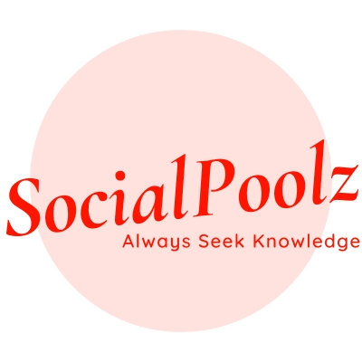
  </a>

  <h1 align="center">SocialPoolz</h1>

  

    An awesome Social QnA Website built with Love <3.
     
    <a href="http://socialpoolz.infinityfreeapp.com/register.php">View Demo</a>
    ·
    <a href="https://github.com/akash-dutta-dev/Socialpoolz/issues">Report Bug</a>
    ·
    <a href="https://github.com/akash-dutta-dev/Socialpoolz/issues">Request Feature</a>
  

  

#Note - This the new repositoey that I have created. Links from the old one might not work.
<!-- TABLE OF CONTENTS -->
# Table of content

  
List

  <ol>
    <li>
      <a href="#about-the-project">About The Project</a>
      <ul>
        <li><a href="#socialpoolz">SocialPoolz</a></li>
        <li><a href="#our-aim">Our Aim</a></li>
        <li><a href="#message-to-new-user">Our Message to New Users</li>
        <li><a href="#built-with">Built With</a></li>
      </ul>
    </li>
    <li>
      <a href="#getting-started">Getting Started</a>
      <ul>
        <li><a href="#prerequisites">Demo</a></li>
        <li><a href="#installation">Installation</a></li>
      </ul>
    </li>
    <li><a href="#features">Features</a></li>
    <li><a href="#contributing">Contributing</a></li>
    <li><a href="#license">License</a></li>
    <li><a href="#contact">Contact</a></li>
  </ol>

<!-- ABOUT THE PROJECT -->
# About The Project

## SocialPoolz

SocialPoolz is a Social QnA Website built with Love. [Click to open](http://socialpoolz.infinityfreeapp.com/register.php)
  
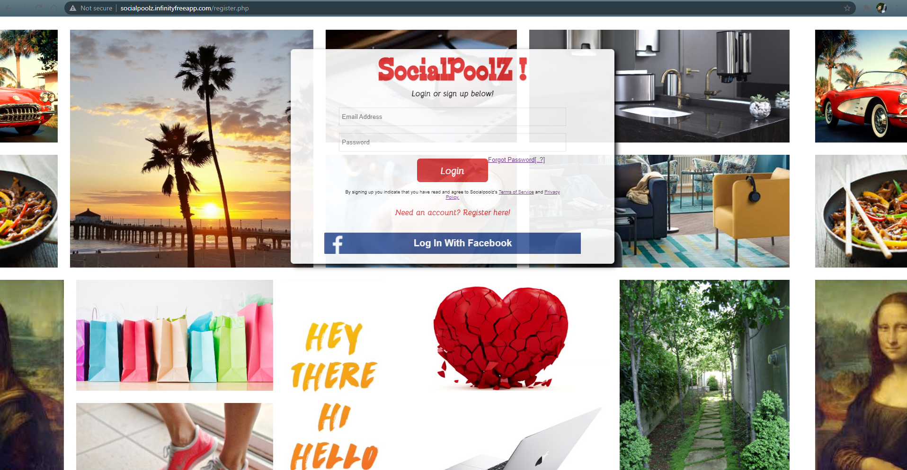

## Our Aim

Our Aim is to provide enormous knowledge to those people who seek for it. Knowledge is something which has a beginning but no end. Reading is something which our World specially need, rather than scrolling some unnecessary post. The only source of knowledge is experience, so we provide experienced expert who work 24x7 to provide relevant answer to your precious questions. We would like us to be called Knowledge Resourcing website rather than Social Networking website.
  
## Our Message to New Users
  
First of all we would like to thank you for visiting SocialPoolz. We always look forward to serve you better. Feel free to ask any question here, because we believe <b>Knowledge</b> is having the right answer but, <b>Intelligence</b> is asking the the right question. Always take a step forward by asking a question.
 
 
As <b>ASK</b> stands for
 
<i>A - Always</i>
 
<i>S - Seek</i>
 
<i>K - Knowledge</i>
 

## Built With
### FrontEnd
- HTML - CSS
- Javascript
- Jquery
- Bootstrap

### Backend 
- PHP
- Ajax

### Database
- MySQL

<!-- Getting Started -->
# Getting Started
## Demo
To view the working demo -
Visit - http://socialpoolz.infinityfreeapp.com/register.php
  
Test Credentials -
 
Username - abc@gmail.com  Password - abc@123
 
Username - test@gmail.com Password - password

## Installation
- Install XAMPP. Run Apache and MySQL server.
- Download the code and place it in the <b>htdocs</b> folder.
- Download the SQL files and import it in your local through <b>phpmyadmin</b>.
- Run localhost port 8080 and then enter the test credentials to login.
- Enjoy.

<!-- Fetures -->
# Features

  
List

  <ol>
    <li><a href="##login">Login</a></li>
    <li><a href="##facebookLogin">Facebook Login</a></li>
    <li><a href="##personalizedProfile">Personalized Profile</a></li>
    <li><a href="##profileInsight">Profile Insight</a></li>
    <li><a href="##questions">Questions</a></li>
    <li><a href="##searchBar">Search Bar</a></li>
    <li><a href="##realtimeConnection">RealTime Connection</a></li>
    <li><a href="##topics">Topics</a></li>
    <li><a href="##report">Report</a></li>
    <li><a href="##infiniteScrolling">Infinite Scrolling</a></li>
    <li><a href="##upvoteDownvote">Upvote Downvote</a></li>
    <li><a href="##commentSection">Comment Section</a></li>
    <li><a href="##notification">Notification</a></li>
    <li><a href="##answer">Answer</a></li>
    <li><a href="##anonymousAnswer">Anonymous Answer</a></li>
    <li><a href="##emailService">Email Service</a></li>
    <li><a href="##followUnfollow">FollowUnfollow</a></li>
  </ol>

 

## Login 
At first comes the login page. That contains three layers of data validation and verification.
all data uses SHA 256 encryption before being stored to database.
New user have to register first before landing on index page.
 
 
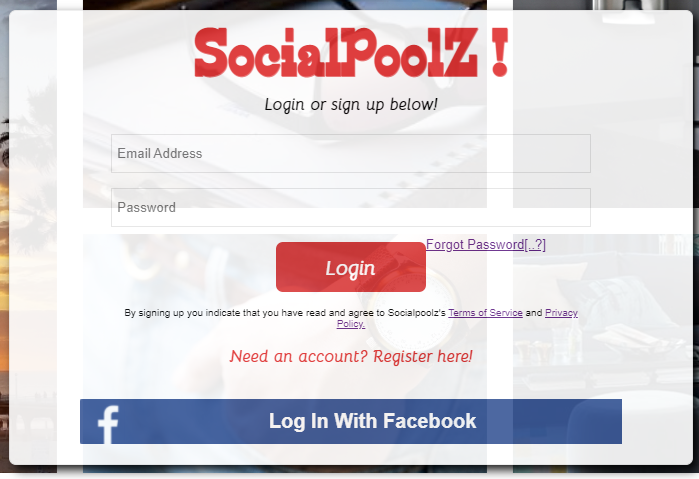

  
## Facebook Login 
To make the login more hassle free. I have implemented Facebook Login, a one click solution for better user experience,
The user detail will be fetched from Facebook using OAuth 2.
 
 
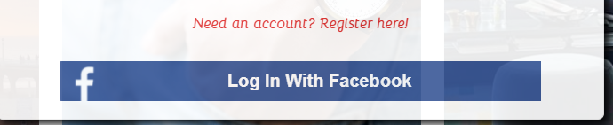

  
## Personalized Profile 
Every user will get their own personalized profile where they can view their regular updates.
Inside their profile almost everything can be customized.
 
 
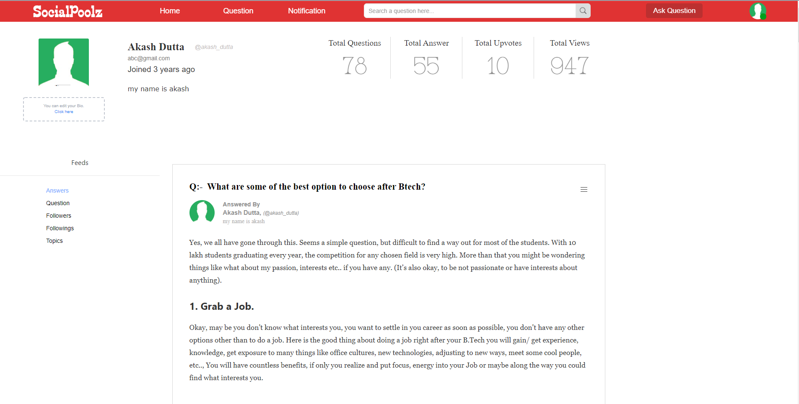

  
## Profile Insight 
Crucial profile data will be highlighted at the top for better experiece.
 
 
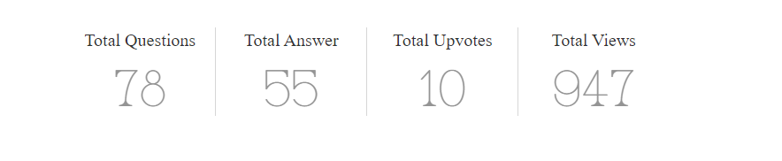

  
## Questions 
User gets the advantage to ask a question and tagging them with relevant topics.
Topics plays a very crucial role here to find the right person to 
answer based on their availability on the network.
 
 
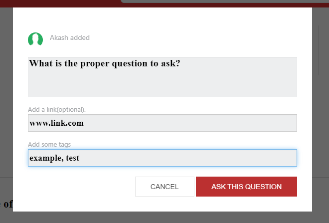

  
## Intelligent Search Bar 
Smart searching have been implemented here with Asynchrounous call that uses Graph Network to show the most
relevant results to the user. Based on the keywords entered and its context, the graph network will determine
 what to display.
 
 
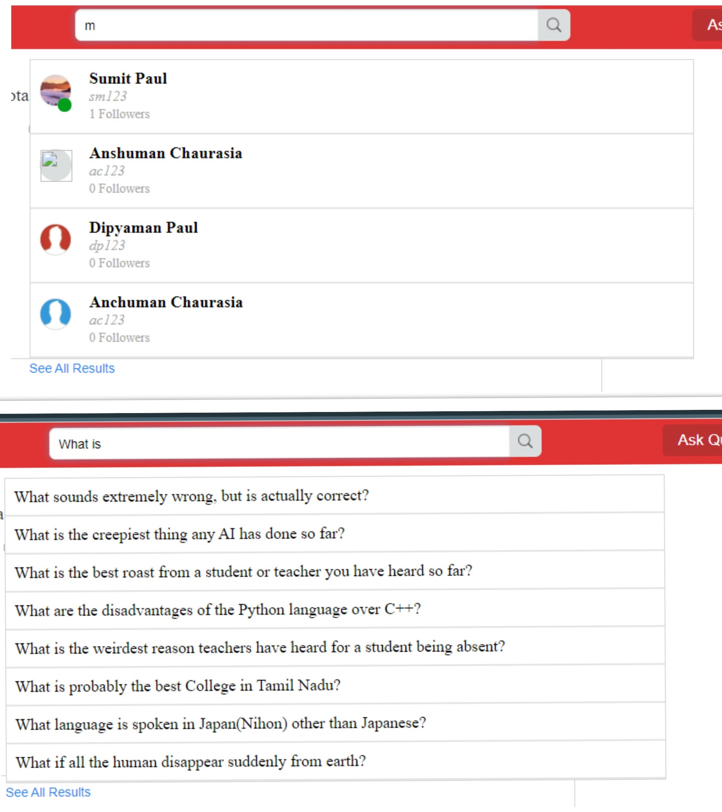

  
## RealTime Connection 
Real-Time 1 on 1 connection will be establised from loggedin user to all of their followers/following and a small green circle 
will indicate the user's current availability on the network.. 
 
 
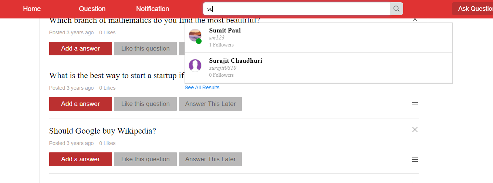

  
## Topics 
Topics play a crucial role in customizing the newsfeed. The index, suggestions and feeds
will be loaded with topics that user have selected/following.
 
 
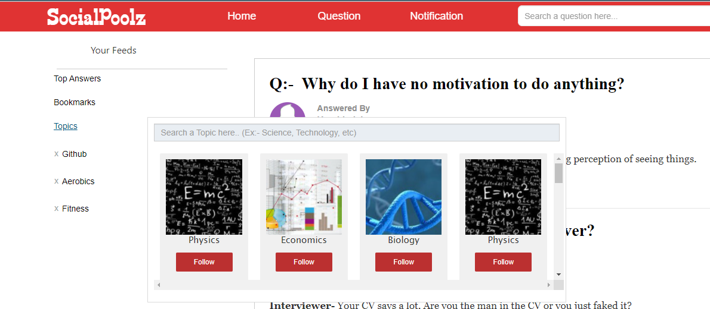

  
## Report 
Reports from user helps us to detect restricted action or violation of policy. The rules are strict,
a user getting reported multiple times might face suspension/permanent ban.
 
 
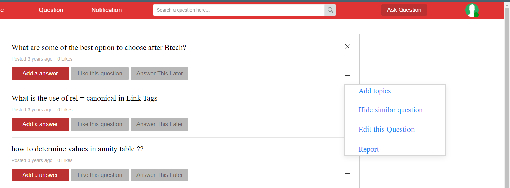

  
## Infinite Scrolling 
Introducing infinite auto newsfeed scrolling that fetches new content everytime the user hits the scroll bar
to extreme bottom in just few milisecond.
 
 
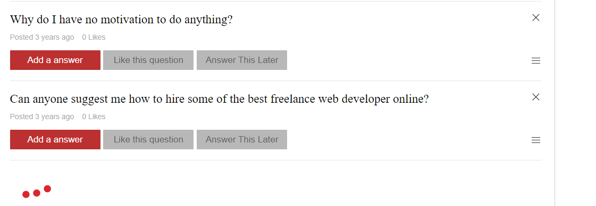

  
## Upvote Downvote 
User have the ability to upvote or downvote an answer. This helps the system to index better answers that 
appears at the top.
 
 
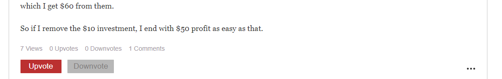

  
## Comment Section 
New Feature !! User can now post their thoughts on every answer they wish. 
 
 
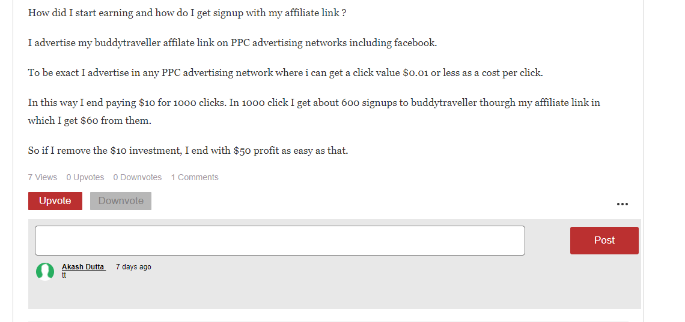

  
## Notification
Notificaition Service runs at the backend that send emails notification 
to user whenever there is a new item and a red dot will appear at the top for unread notifications.
 
 
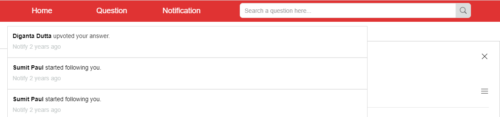

  
## Answer 
Lighweighted custom answering tool bar.
 
 
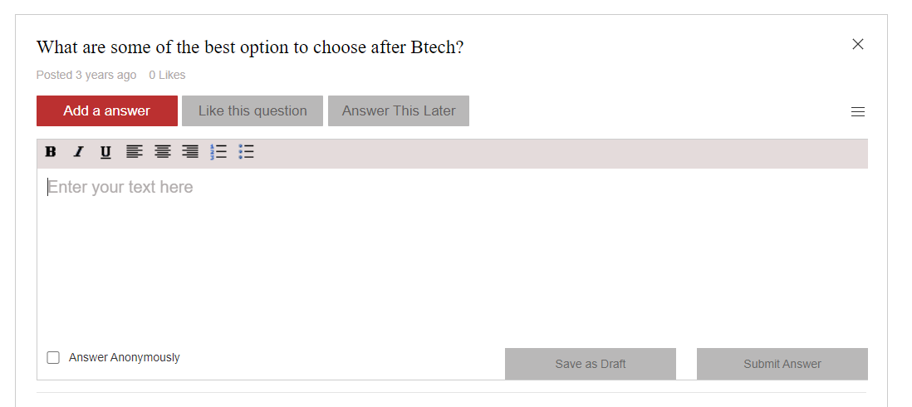

  
## Anonymous Answer 
Users also have the option to keep themselves hidden while answering the question.
If they tick this box, their profile will be kept hidden from other users.
 
 
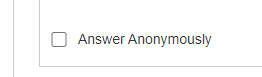

  
## Email Service 
Email Service being used while sending notification or login otp.
 
 
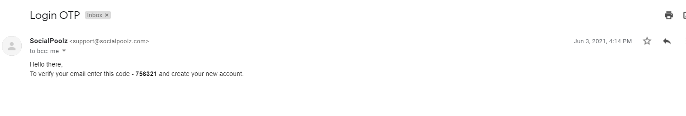

  
## Follow Unfollow 
User can now follow or unfollow to other users.
 
 
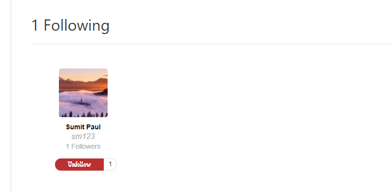

<!-- CONTRIBUTING -->
# Contributing

Contributions are what make the open source community such an amazing place to be learn, inspire, and create. Any contributions you make are **greatly appreciated**.

1. Fork the Project
2. Create your Feature Branch (`git checkout -b feature/AmazingFeature`)
3. Commit your Changes (`git commit -m 'Add some AmazingFeature'`)
4. Push to the Branch (`git push origin feature/AmazingFeature`)
5. Open a Pull Request

<!-- LICENSE -->
# License

Distributed under the MIT License. See `LICENSE` for more information.

<!-- CONTACT -->
# Contact

Email - akash.dutta9830489799@gmail.com

LinkedIn - https://www.linkedin.com/in/akash-dutta/ 

Instgram - https://www.instagram.com/akash_dutta97
